# 基于中文文字生成视频的表情包制作软件
荣获《英特尔人工智能创新应用大赛》总决赛 个人赛道 三等奖

荣获《英特尔人工智能创新应用大赛》创新创业专项赛 个人赛道 卓越创新团队

## 1，软件界面

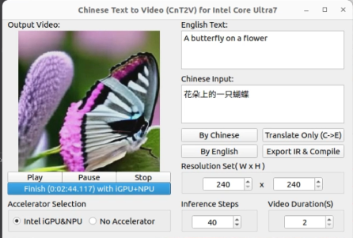

## 2，生成的视频

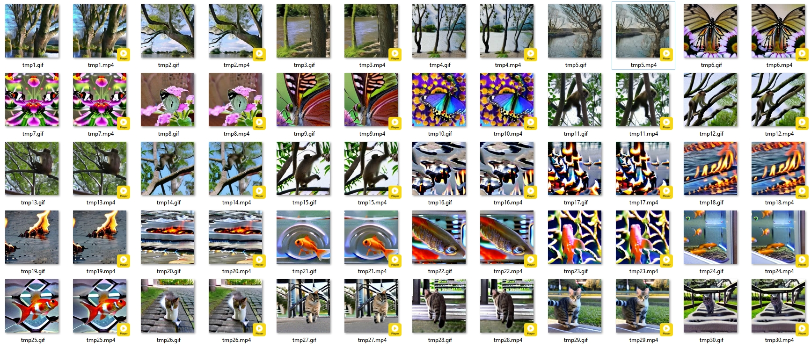

相关提示词：河边的树，花朵上的一只蝴蝶，一只猴子在爬树，水上燃烧的火焰，一只在鱼缸中的金鱼，一只熊猫在岩石上吃竹子 等。

## 3，方案简介

**· 采用翻译模型与文本生成视频模型的结合，实现中文文字生成视频。**规避了训练/调参的周期长成本高的方法，实现了对中文的快速支持,避免了直接运行中文到视频模型的超大RAM需求。

**·  全部推理过程完全本地化，并且使用了intel的iGPU+NPU的混合加速推理技术。**在intel Core Ultra7处理器上，充分使用iGPU+NPU的混合推理加速，提高用户体验，保护用户隐私。

**·  底层基于OpenVINO，上层基于Qt，便于二次开发和移植和嵌入式应用。**目前OpenVINO已经是支持平台最广、通用性最强的人工智能的API之一，并且是开源的，全球有无数开发者在使用。

**·  使用NNCF量化压缩，让推理速度更快，模型体积更小。**将模型转换为IR格式后，采用NNCF将非关键部分的权重压缩为INT8_ASYM,即减小了RAM的需求,又加快了推理速度

·  **代码采用C++与Python混合编程，支持更复杂的功能开发与实现。**即保留了C++代码高效运行的特点，又兼顾了Python强大功能扩展的优势，使用原生标准的Python-C库开发。

**·  代码全部开源，让全球无数的开发者一起完善和优化代码。**开源软件生态的重要性不言而喻，开源以后，用的人越多，代码就会越完善，与全球无数开发者一起进步。

## 4，软硬件拓扑

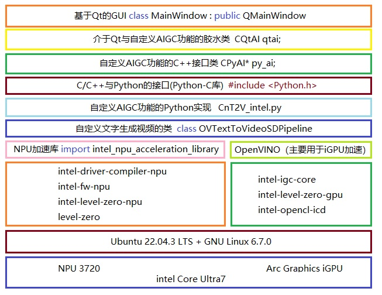

## 5，数据处理流程

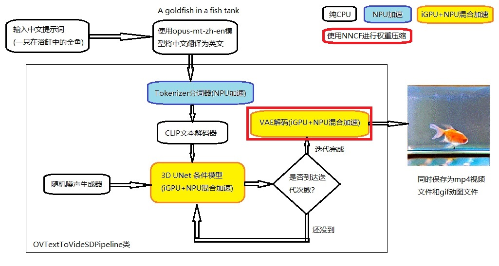

## 6，源码目录结构

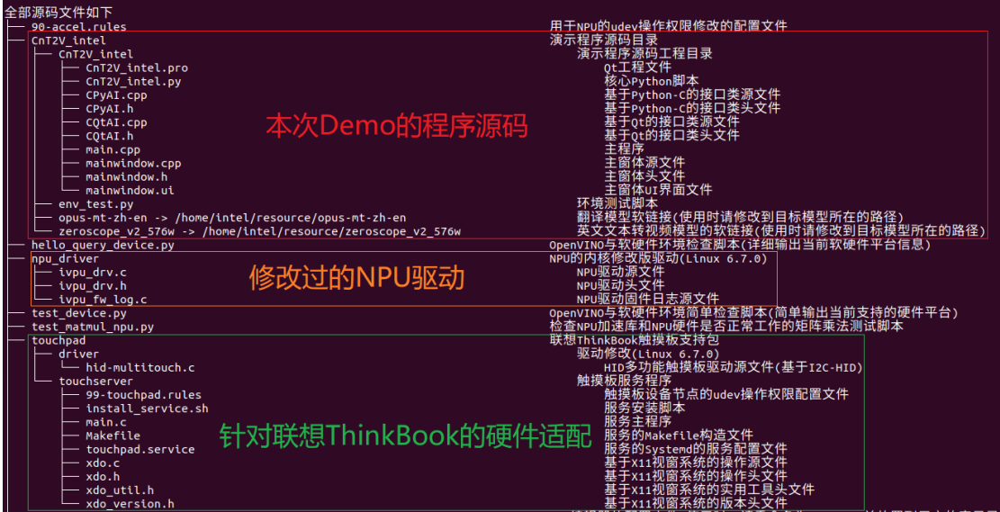

## 7，资源文件目录结构

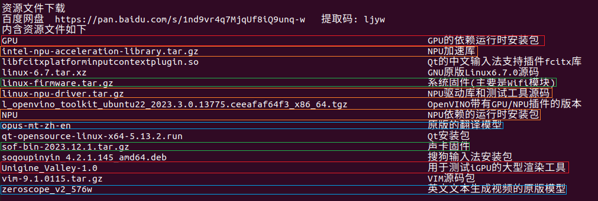

## 8，关键代码说明

### 8.1，当单击生成视频按钮后

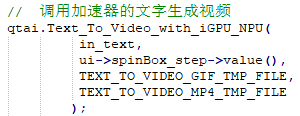

### 8.2，然后再CQtAI类内部

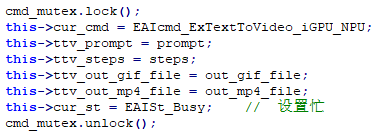

### 8.3，CQtAI类线程内部

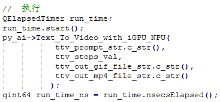

### 8.4，CPyAI类内部

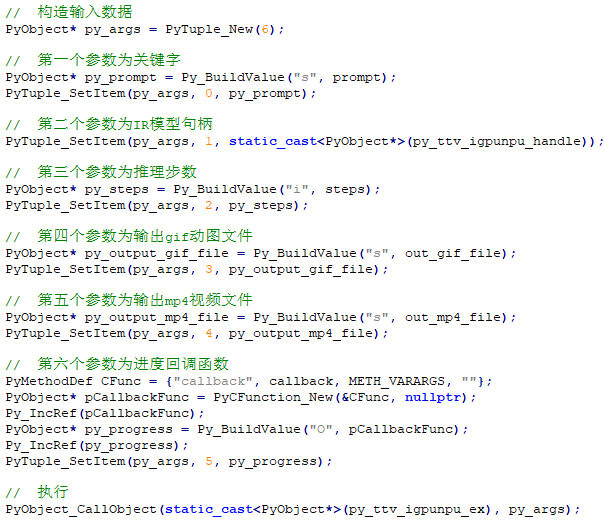

### 8.5，在CnT2V_intel.py内部，即准备阶段，对非关键部分(VAE使用了NNCF的权重压缩)

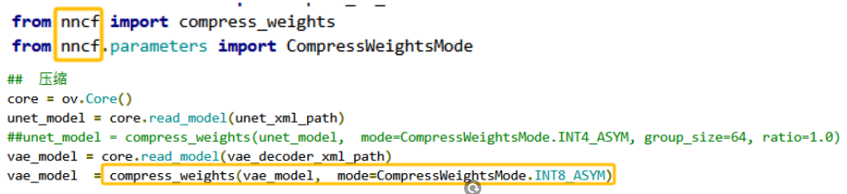

然后将UNET和VAE采用MULTI:GPU,NPU的混合推理方式，分别将IR模型编译部署到iGPU和NPU上。并且，对于分词器部分，采用intel的NPU加速库，将IR模型编译部署到NPU上。

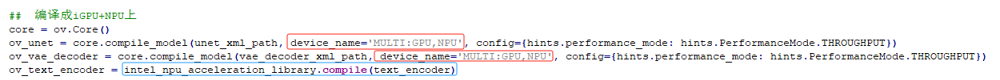

pipeline的代码参考：https://docs.openvino.ai/2023.3/notebooks/253-zeroscope-text2video-with-output.html

### 8.6，在CnT2V_intel.py内部，也就是推理阶段

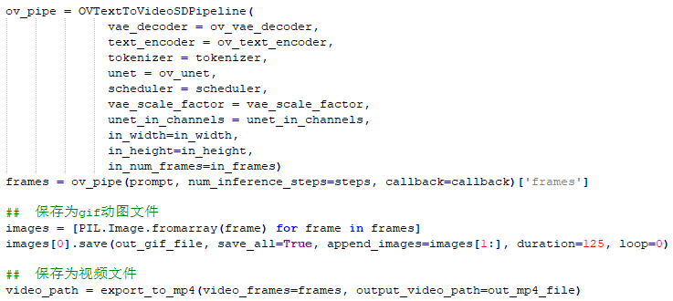

### 8.7，当完成视频生成后

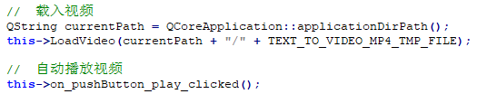

此时将会依赖一些Qt的MP4解码类

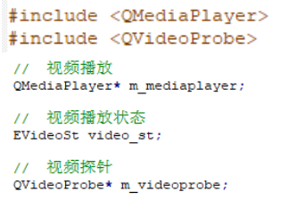

### 8.8，解码MP4视频文件的每一帧，并显示（支持YV12，YUV420P，NV12等）

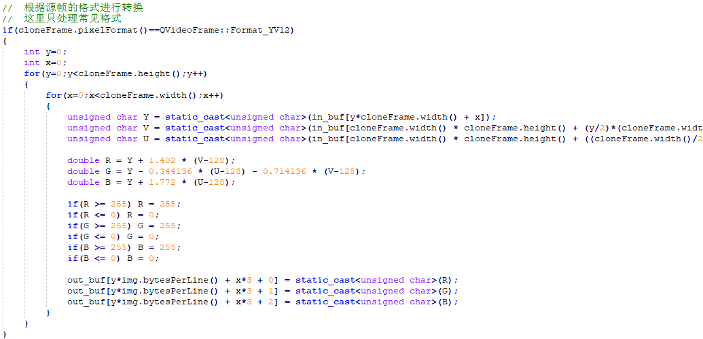

## 9，软件软件版本依赖

### 9.1，OpenVINO版本

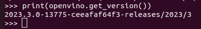

### 9.2，NPU加速库版本

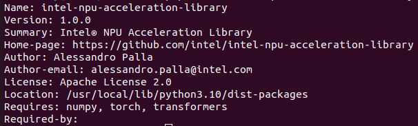

### 9.3，NNCF版本

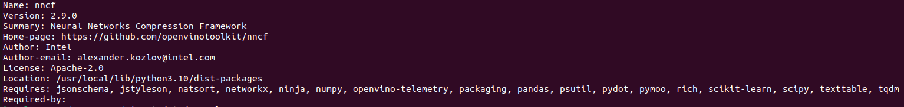

### 9.4，系统版本

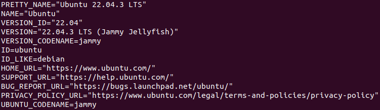

### 9.5，内核版本

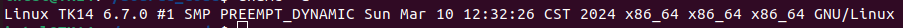

### 9.6，GPU运行依赖

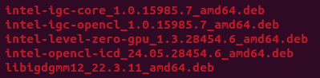

### 9.7，NPU运行依赖

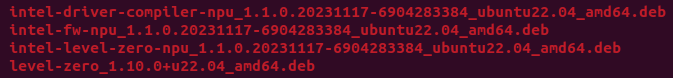

### 9.8，资源文件打包下载

百度网盘  链接: https://pan.baidu.com/s/1nd9vr4q7MjqUf8iQ9unq-w 提取码: ljyw 

## 10，成功识别到iGPU+NPU

利用OpenVINO的Samples中的hello_query_device.py脚本，可以看到成功识别到iGPU和NPU，并且打印详细信息：

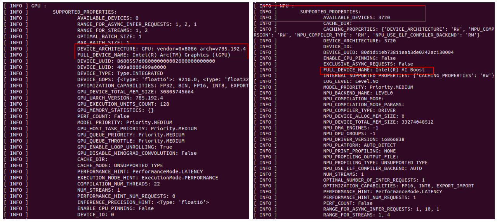

## 11，情况对比

### 11.1，CPU，NPU，iGPU占用率对比

当使用iGPU+NPU混合推理加速时：

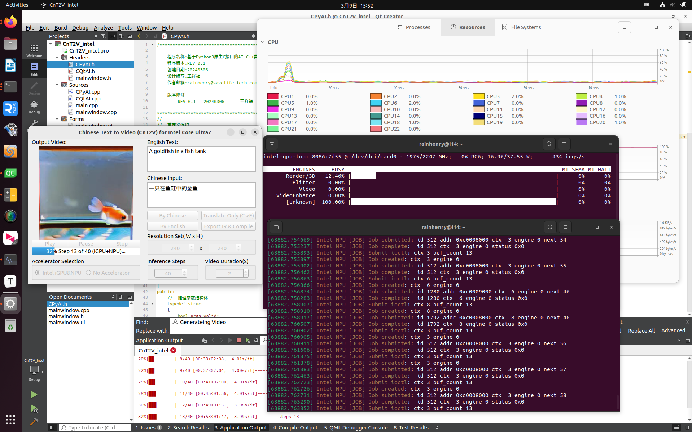

当仅仅使用CPU时：

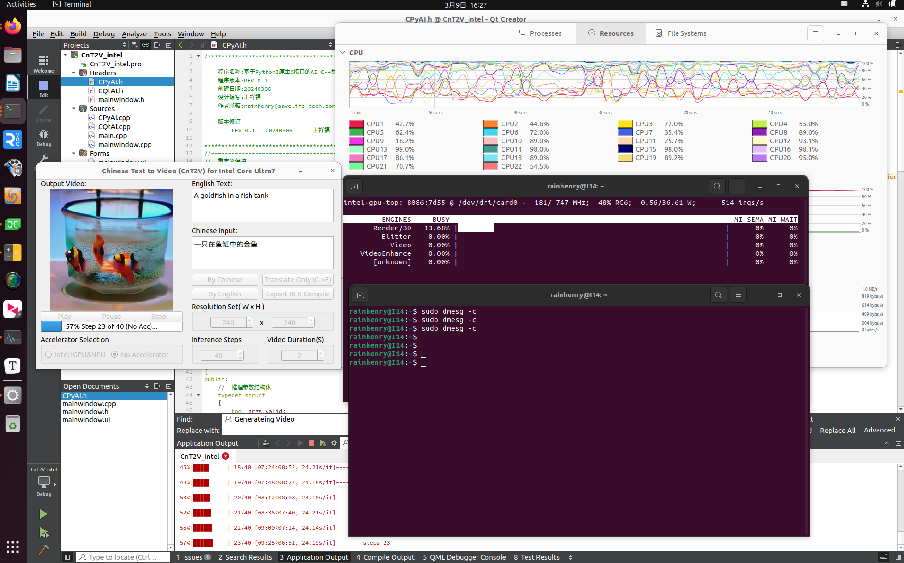

### 11.2，运行时间对比(性能提升约496%)

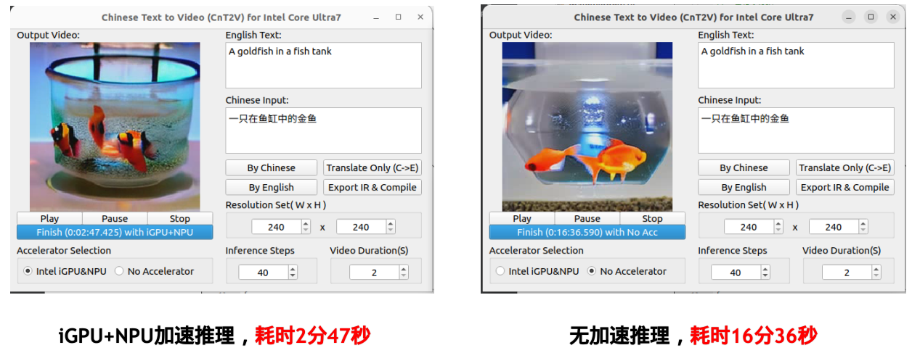

### 11.3，模型尺寸情况对比(模型体积缩小64.5%)

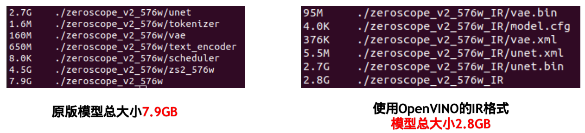

### 11.4，温度(功耗)对比（降低了43℃）

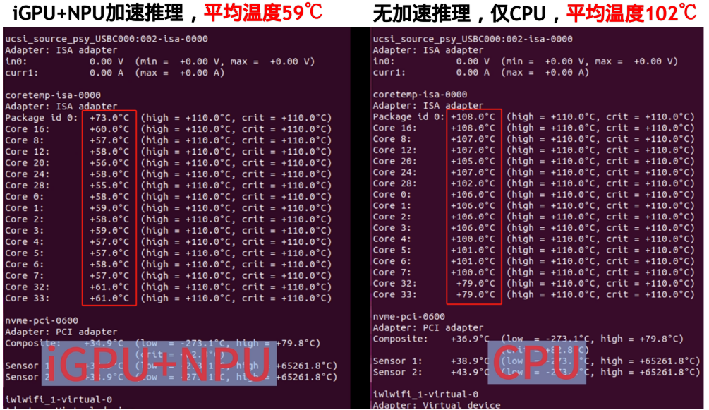

## 12，运行机器

采用的是搭载Intel Core Ultra7处理器的联想ThinkBook 14

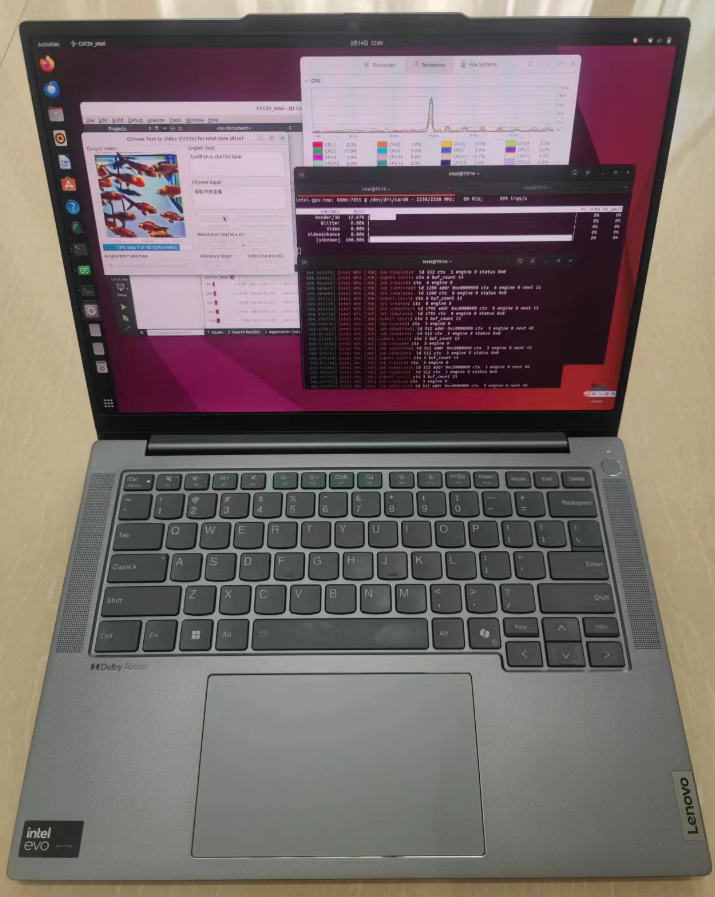

## 13，演示与搭建视频

【基于中文文字生成视频的表情包制作软件-哔哩哔哩】 https://b23.tv/bH8IVii

## 14，联系方式

邮箱 rainhenry@savelife-tech.com

## 15，许可证

本代码采用GPLv3许可证 https://www.gnu.org/licenses/gpl-3.0.en.html
